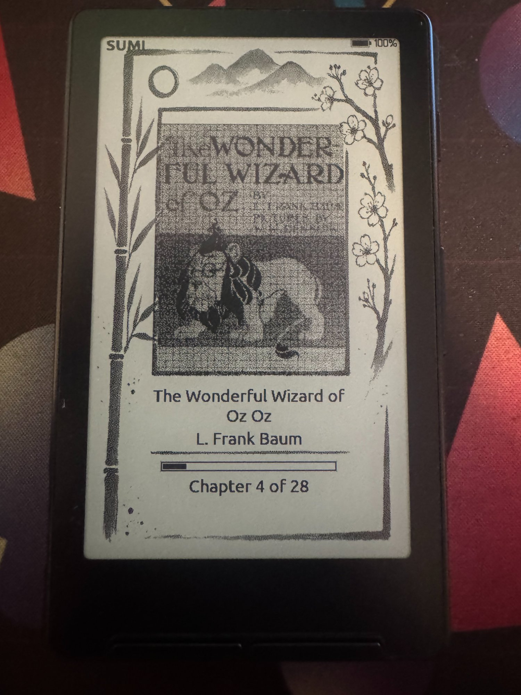
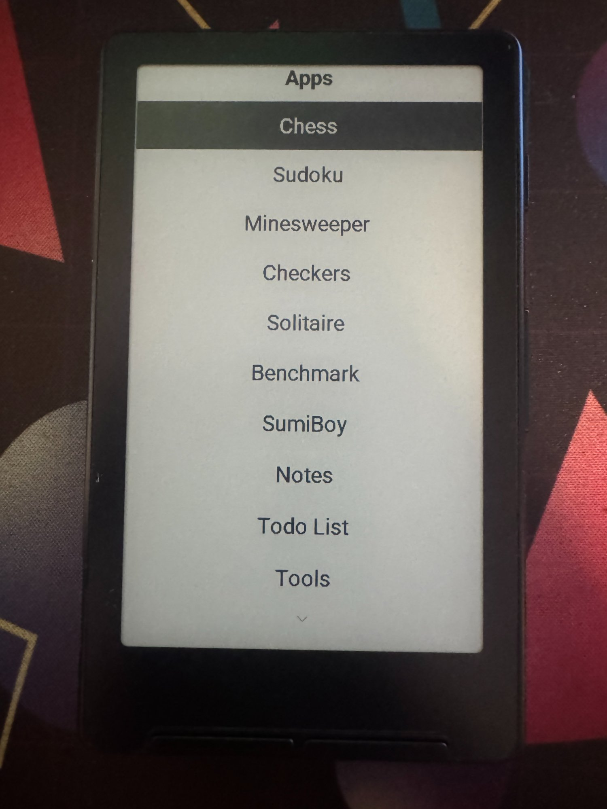
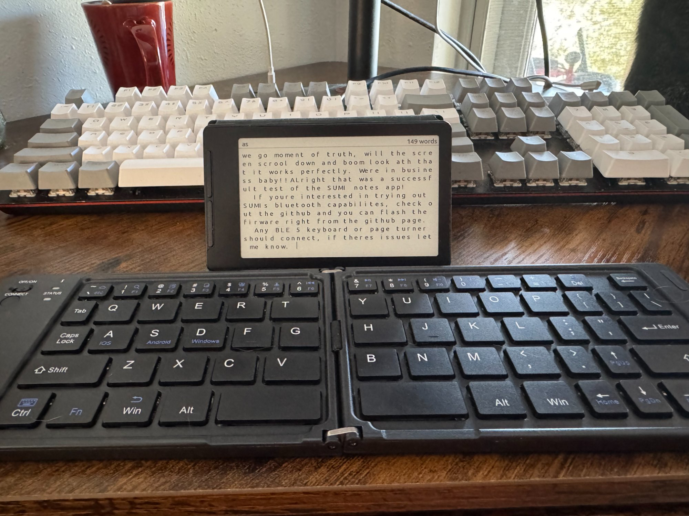
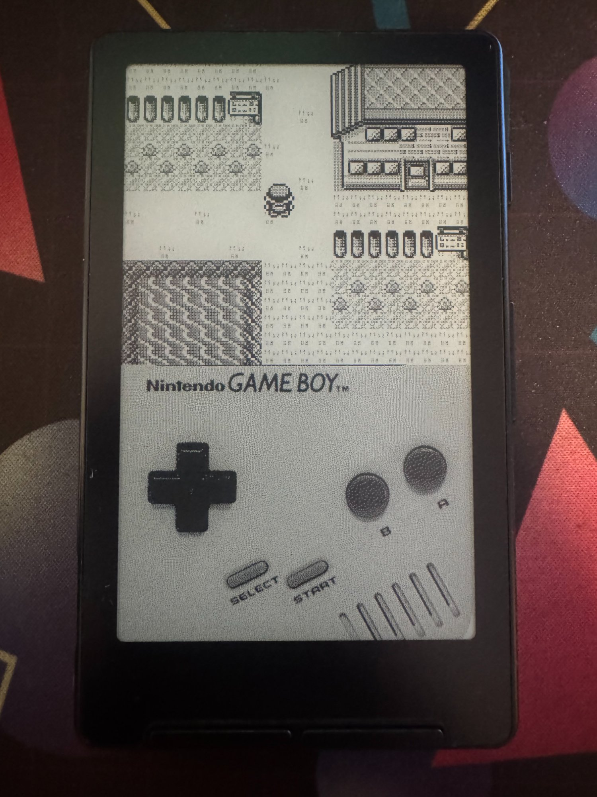
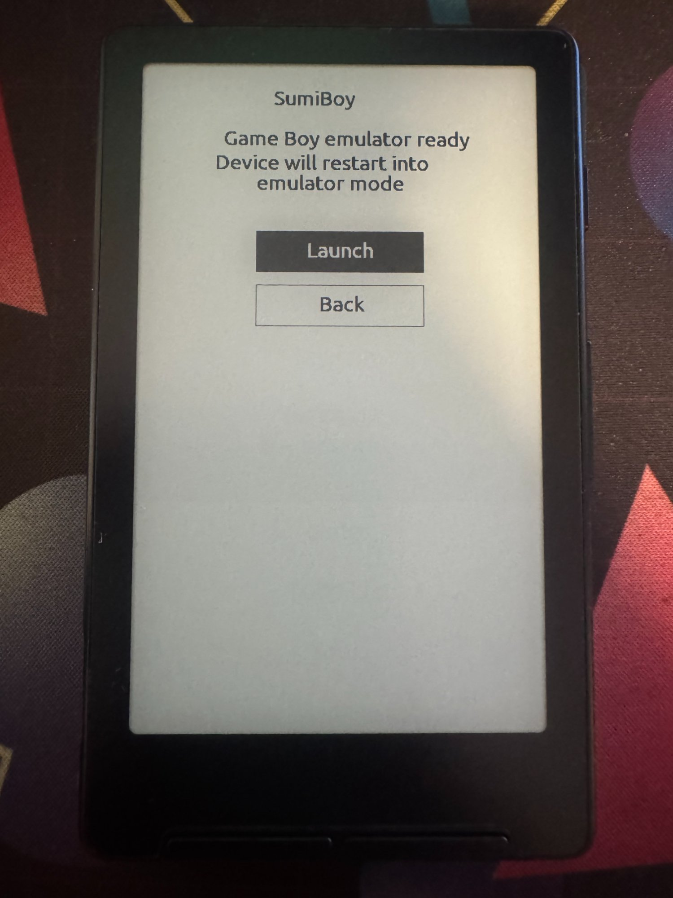

# SUMI

Custom e-ink firmware for the **Xteink X4** — a $70 ESP32-C3 e-reader with 380KB of RAM, a 480×800 display, and five buttons.

SUMI turns it into an offline-first reader with apps, Bluetooth keyboards, and a Game Boy emulator. No WiFi, no cloud, no accounts. Books and tools on paper-like glass.

<p align="center">
  
</p>

> **📖 Got existing ebooks?** Run them through the [Universal Converter](https://sumi.page/convert/) before loading. Most EPUBs are built for color tablets — oversized images, web fonts, heavy CSS. The converter strips all that out and tunes everything for e-ink: grayscale images at display resolution, clean XHTML, no junk. Same books, noticeably faster rendering on the 380KB device.

Built on [Papyrix](https://github.com/pliashkou/papyrix) by **Pavel Liashkov** ([@bigbag](https://github.com/bigbag)) — an excellent open-source reader firmware. Papyrix itself is a fork of [CrossPoint Reader](https://github.com/crosspoint-reader/crosspoint-reader) by Dave Allie. SUMI strips out WiFi, adds a plugin system, games, productivity apps, Bluetooth, and a visual rebrand. The reading engine is Pavel's and Dave's work — outstanding open-source software.

Companion tools at **[sumi.page](https://sumi.page)** — browser-based converters, a newspaper builder, flashcard creator, font converter, and more.

---

## What makes SUMI different

### 📚 Library Carousel

The home screen tracks your last 10 books. Use Up/Down to scroll through recently opened books — see the cover, title, and progress for each one, then press OK to jump right in. No digging through folders to find what you were reading yesterday.

### 🎨 Swappable Home Art Themes

The home screen isn't just functional — it's art. Choose from ten built-in themes (sumi-e, art nouveau, celtic, botanical, woodcut, geometric, retro 70s, doodle, art deco, nautical) or add your own. Settings → Home Art shows a 2×2 visual preview grid. Drop any 800×480 1-bit BMP into `/config/themes/` and it appears as an option.

### 📲 Wireless File Transfer

Upload files directly from your browser — no USB cable needed. The [sumi.page](https://sumi.page) tools connect to SUMI over Bluetooth and stream files straight to the SD card. Convert an EPUB, build a newspaper, generate flashcards, then tap "Send to Device" and it's there in seconds.

### 🎮 13 Built-in Apps

Chess, Sudoku, Solitaire, Minesweeper, Checkers, Flashcards, Notes, Todo List, Image Viewer, Maps, Tools — plus a Game Boy emulator. The plugin system lets anyone add more.

### ⌨️ Bluetooth Keyboard Support

Pair any BLE keyboard and type in Notes. Page turners work in the reader too. Real typing on an e-ink screen.

---

## What it does

**Reads books.** EPUB, TXT, Markdown, XTC. Adjustable fonts, sizes, margins, line spacing, alignment. Chapter navigation, progress tracking, cover art, thumbnails, CSS styling, inline images, RTL for Arabic and Hebrew, table rendering. Minimum-raggedness line breaking with Liang/Knuth hyphenation across 28 languages. The reading engine is Papyrix — SUMI adds the typographic refinements.

**Runs apps.** 13 plugins and counting — a sandboxed plugin system where any `.h` file dropped into `src/plugins/` becomes a launchable app.

<p align="center">
  
</p>

**Types.** Pair any BLE keyboard and type in the Notes editor. Page turners work in the reader too.

<p align="center">
  
</p>

**Plays Game Boy.** SumiBoy is a dual-boot launcher — it checks the app1 partition for emulator firmware and OTA-swaps to it. The emulator swaps back the same way. Pokemon on an e-ink screen runs at about 3 FPS and it's still somehow fun.

<p align="center">
  
  &nbsp;&nbsp;
  
</p>

---

## What comes from where

SUMI wouldn't exist without Papyrix and CrossPoint. Here's an honest accounting.

### Papyrix / CrossPoint: the reader foundation (~85,600 lines, 83%)

The EPUB engine (streaming XML parser, ZIP decompression, OPF metadata, TOC parsing, CSS, HTML-to-pages renderer, inline images, text layout, justification, RTL). ReaderState (pagination, background caching, spine navigation, progress). The rendering stack (1-bit graphics, bitmap fonts, dithering, fax compression). Text shaping (Arabic, Thai, script detection). The state machine, content providers, all the libraries. This is the hard code and Pavel Liashkov and Dave Allie wrote it.

### SUMI removed WiFi (~4,400 lines)

The ESP32-C3 has 380KB of RAM and WiFi eats ~100KB while fragmenting the heap. Removing it buys enough memory for plugins and BLE. Gone: WiFi driver, web server, credential store, Calibre OPDS sync, network states.

### SUMI added plugins, BLE, and content awareness (~17,700 lines)

The plugin framework (~1,000 lines), 13 plugins (~10,300 lines), BLE HID input (477 lines), content hint pipeline (~100 lines), library index (202 lines), memory arena and bump allocator, minimum-raggedness line breaking, Liang/Knuth hyphenation (28 languages), flash thumbnail cache, home screen art and themes, expanded settings, and file browser upgrades.

### Numbers

```
                          Papyrix 1.6.5       SUMI
                          ─────────────       ────
Application code (src/)    14,630 lines     28,365 lines
Libraries (lib/)           75,873 lines     74,977 lines
Total                      90,503 lines    103,342 lines

From Papyrix:             ~85,600  (83%)
From SUMI:                ~17,700  (17%)
```

In the application layer (`src/`), SUMI wrote ~58%. But Papyrix's 42% is the reader engine, content providers, state machine, and rendering pipeline — the code that makes the device actually work as an e-reader.

---

## Hardware

| | |
|---|---|
| **MCU** | ESP32-C3 (RISC-V, single core, 160MHz) |
| **RAM** | 380KB usable (WiFi disabled) |
| **Display** | 480×800 e-ink, 1-bit, SSD1677 controller |
| **Storage** | SD card (FAT32) |
| **Input** | 5-way d-pad + power button |
| **Connectivity** | Bluetooth Low Energy 5.0 |

## SD Card

Drop your EPUBs anywhere — the file browser walks everything from root. These folders are either auto-created or optional:

```
/
├── (your books, anywhere)
├── config/
│   ├── fonts/          ← Custom .bin fonts from sumi.page/fonts
│   └── themes/         ← Home art themes (800×480 1-bit BMP)
├── flashcards/         ← .tsv decks (auto-created by plugin)
├── images/             ← .bmp files for Image Viewer (auto-created)
├── sleep/              ← .bmp files for random sleep screens (480×800)
├── maps/               ← Map tile BMPs (auto-created)
├── notes/              ← Notes plugin saves here (auto-created)
└── .sumi/              ← System, don't touch
    ├── settings.bin    ← User preferences
    ├── library.bin     ← Per-book progress + content hints
    ├── recent.bin      ← Recently opened books for home carousel
    └── cache/          ← Thumbnail and format caches
```

## Building

Requires [PlatformIO](https://platformio.org/).

```bash
pio run                    # Build
pio run -t upload          # Flash via USB
pio device monitor         # Serial console
```

Or flash from Chrome: **[sumi.page/flasher](https://sumi.page/flasher/)**

## Plugin development

```cpp
class MyPlugin : public PluginInterface {
public:
    const char* name() const override { return "My Plugin"; }
    void init(PluginRenderer& r) override { /* setup */ }
    bool update(PluginRenderer& r, PluginButton btn) override {
        r.fillScreen(1);
        r.setCursor(10, 30);
        r.print("Hello from my plugin!");
        r.display();
        return true;
    }
};
```

Register in `main.cpp`, or scaffold from templates at **[sumi.page/plugins](https://sumi.page/plugins/)**.

## Memory

ESP32-C3 has ~400KB SRAM. With WiFi disabled and BLE-only, SUMI has ~300KB available for application use.

**Memory Arena (80KB)** — Single contiguous allocation at boot, split into a primary buffer and work buffer. Eliminates heap fragmentation:
- `primaryBuffer` (32KB) — Shared by image decode and ZIP decompression (time-shared, never concurrent)
- `rowBuffer` (4KB) — Bitmap row I/O
- `ditherBuffer` (32KB) — Error diffusion rows for JPEG dithering
- `imageBuffer2` (4KB) — Scaling accumulators
- `scratchBuffer` (8KB) — Thumbnails, temp ops

**Bump allocator** — The entire arena doubles as a scratch pool via `scratchAlloc()`. Text layout uses this for DP line-breaking arrays and hyphenation vectors, avoiding heap fragmentation. `ArenaScratch` RAII guard auto-resets the watermark.

**Everything streams** — EPUB parsed via streaming XML, never loaded fully. Page layouts cached to SD. Thumbnails stored in LittleFS flash for instant home screen. Library index at 9 bytes per book. One content provider allocated at a time.

## Credits

SUMI is built on **Papyrix** by **Pavel Liashkov** ([@bigbag](https://github.com/bigbag)), which is itself a fork of **CrossPoint Reader** by **Dave Allie**. The reader engine, EPUB parser, rendering pipeline, font system, text shaping, and state machine are their work. Outstanding open-source software.

- [Papyrix](https://github.com/pliashkou/papyrix) by Pavel Liashkov (MIT License)
- [CrossPoint Reader](https://github.com/crosspoint-reader/crosspoint-reader) by Dave Allie (MIT License)
- **@ngxson** — Power management and button remapping
- **sumi.page** — Companion web tools

## License

MIT — see [LICENSE](LICENSE). Original Papyrix code copyright Pavel Liashkov. Original CrossPoint code copyright Dave Allie. SUMI additions copyright SUMI Contributors.
