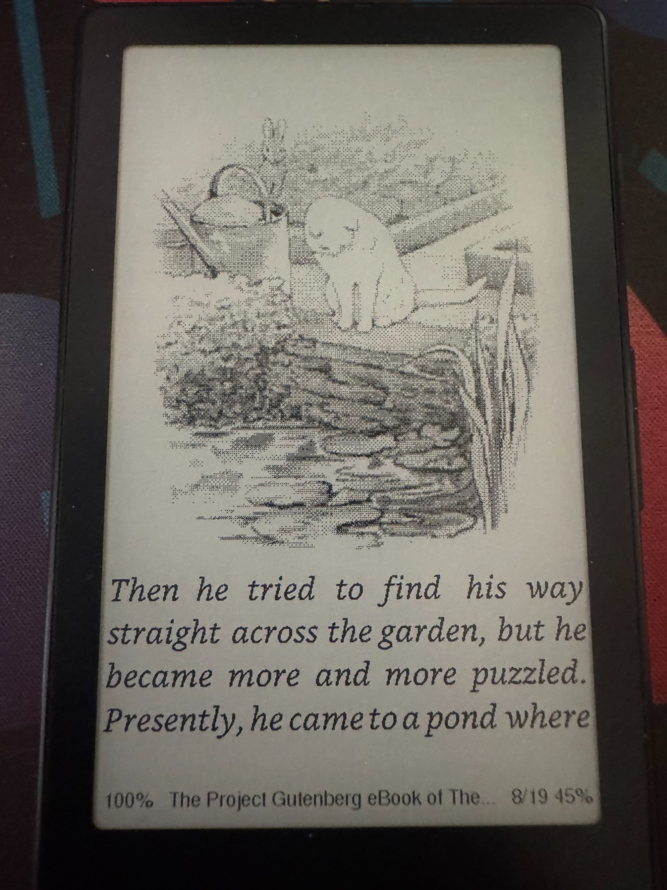
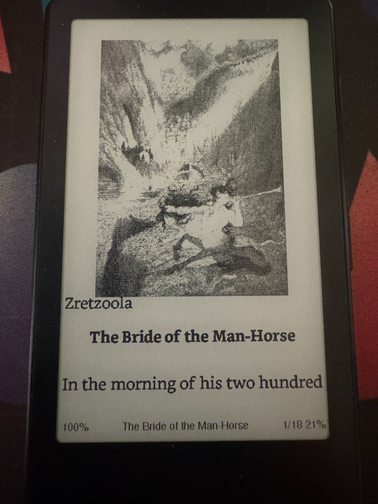
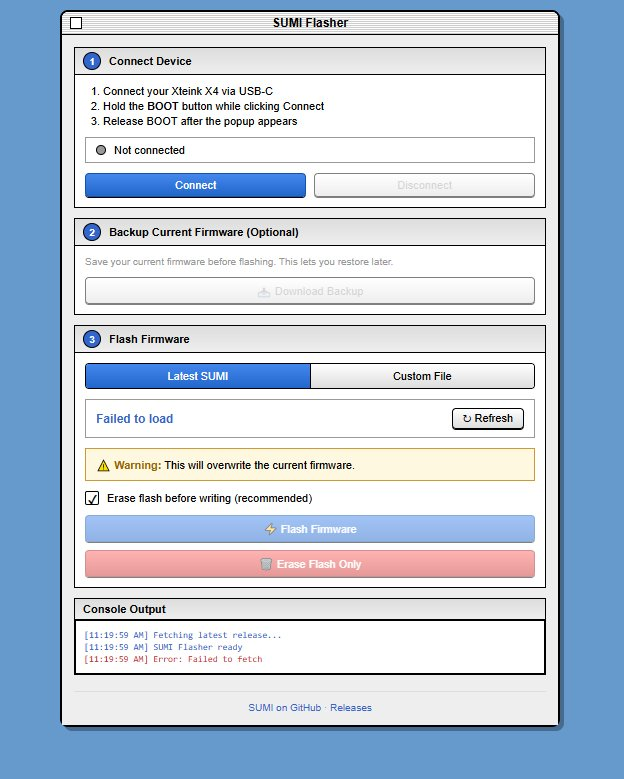
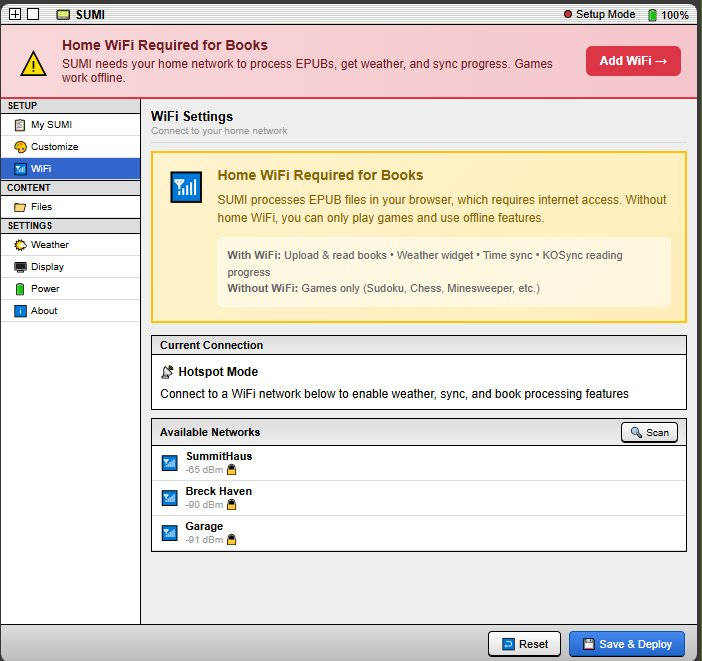
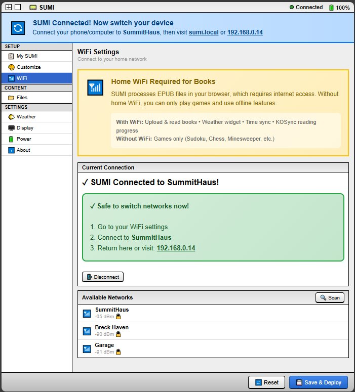
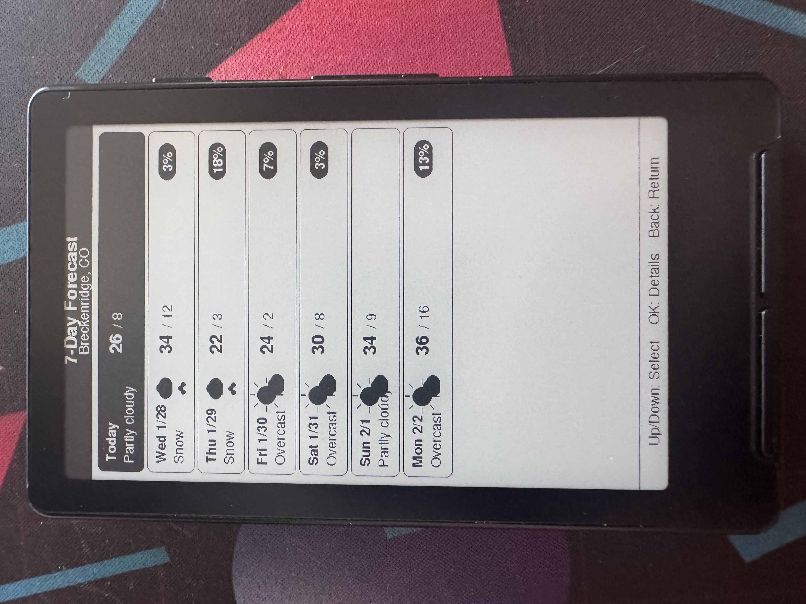
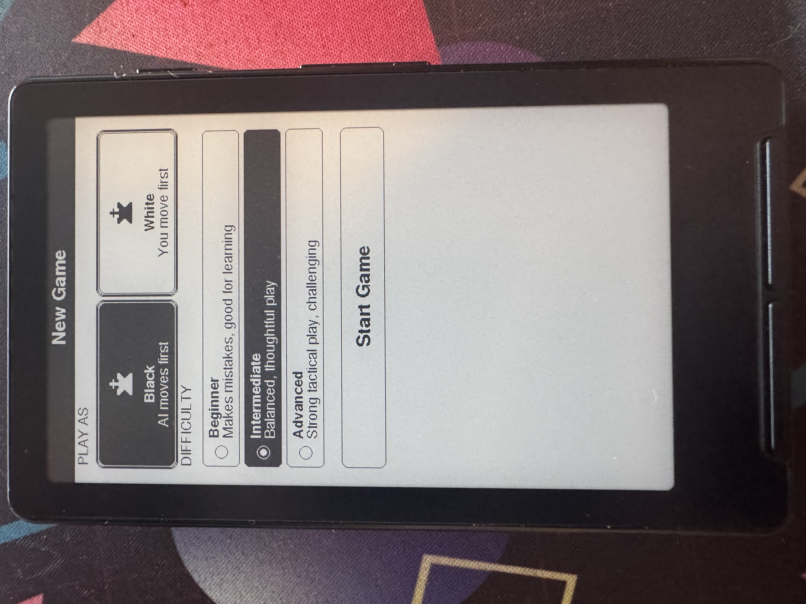
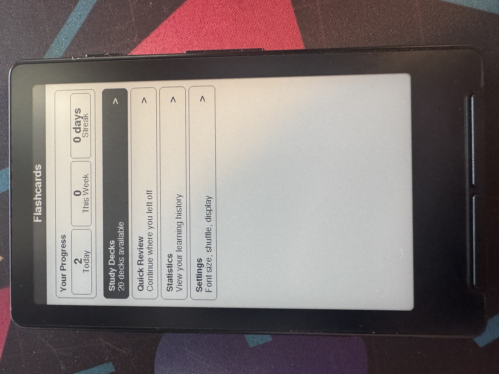
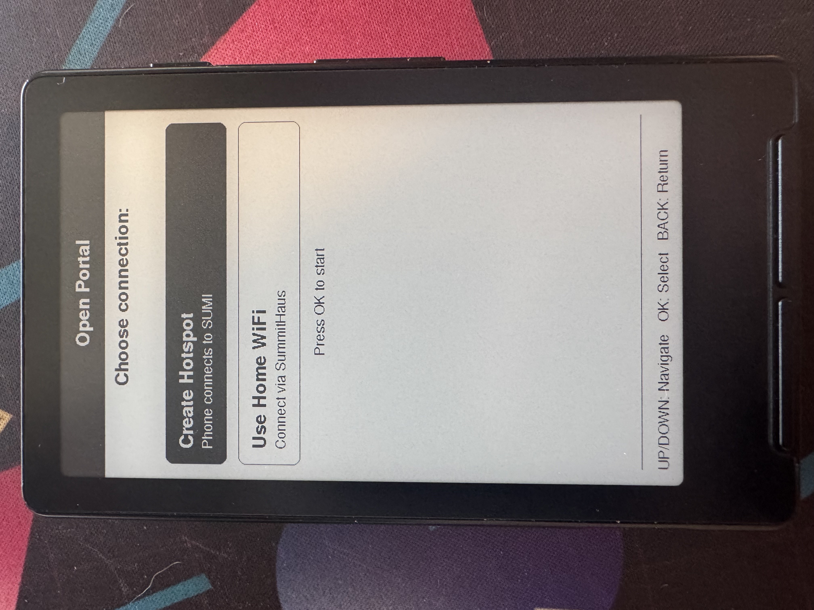

# SUMI

**Ink, Simplified.**

Custom firmware for the Xteink X4

---

<p align="center">
  
  
  
</p>

---

## ⚡ Quick Start: Web Flasher

**Flash SUMI directly from your browser - no software to install!**

<p align="center">
  
</p>

### → [Launch Web Flasher](https://psychoplath9450.github.io/SUMI/flasher/)

1. Connect your Xteink X4 via USB-C
2. Click **Install SUMI**
3. Select the USB serial port

> **Requirements:** Chrome, Edge, or Opera browser (Firefox/Safari not supported)

---

## ⚠️ Important: Read This First

**This project is a work in progress.** While the e-reader and most features work well, some things may still have bugs. If you run into issues:

- Check the [CHANGELOG](CHANGELOG.md) for recent fixes
- File an issue on GitHub
- Or just use the **factory firmware** that came on your device

SUMI is an active hobby project focused on making the Xteink X4 more useful. I'm sharing it because it might be helpful to others with similar devices.


## ⚠️ SD Card Folder Structure (REQUIRED)

**The firmware will only recognize files in folders with these EXACT names.** If your folders are named anything else, SUMI won't find your files.

<p align="center">
  
</p>

```
SD Card Root/
├── books/          ← Put your .epub files here
├── flashcards/     ← Flashcard deck files go here
├── images/         ← BMP images only
├── maps/           ← Map tiles (if using maps)
└── notes/          ← Text notes
```

### Easy Setup (Recommended):

**Just copy the contents of the `sample_sd/` folder to your SD card!** It includes:
- 4 classic novels from Project Gutenberg (ready to process)
- 20+ language flashcard decks (Spanish, French, Japanese, Klingon, and more!)
- Sample images
- Weather icons and chess pieces

### Manual Setup:

If you prefer to start fresh:
1. Insert your SD card into your computer
2. Create folders with these **exact lowercase names**: `books`, `flashcards`, `images`, `notes`, `maps`
3. Add your files to the appropriate folders
4. Insert SD card

### Important Notes:
- **Folder names must be lowercase** and spelled exactly as shown
- **Don't rename these folders** - the firmware looks for these specific names
- The firmware creates hidden folders (`.sumi`, `.config`) automatically - don't delete these


---


## What Even Is This?

SUMI is custom firmware that turns your Xteink X4 into a little e-ink companion device with:

- A customizable home screen with widgets and apps you choose
- A web-based portal for configuration (no tiny screen menus!)
- **E-Reader with bookmarks, reading stats, and progress sync**
- Weather display with 7-day forecast
- Games (Chess, Sudoku, Minesweeper, Solitaire, and more)
- Spaced repetition Flashcards (FSRS algorithm)
- Bluetooth page turner support
- And other stuff

The whole idea is that you configure everything through a nice web interface on your phone/computer rather than navigating menus with 5 buttons on a slow e-ink screen.

---

## 📶 WiFi Requirement

**SUMI requires a home WiFi connection for book processing and most features.**

| With Home WiFi | Without WiFi (Hotspot Only) |
|----------------|----------------------------|
| ✅ Upload and read books | ❌ Cannot upload/process books |
| ✅ Weather widget | ❌ No weather |
| ✅ Time synchronization | ❌ No time sync |
| ✅ KOSync reading progress | ❌ No sync |
| ✅ Full portal features | ⚠️ Limited portal (WiFi setup only) |
| ✅ All games | ✅ All games |

**Why?** SUMI processes EPUB files in your web browser (not on the device), which requires internet access. This approach saves RAM and makes the e-reader faster, but it means you need WiFi to upload books.

**First-time setup:** The setup wizard will guide you through connecting to your home WiFi. After that, access the portal at `sumi.local` from any device on the same network.

---

## The Good, The Bad, and The Crashy

Let me be real about where things stand:

### ✅ Works Pretty Well

- **The Portal** - The web configuration interface is actually nice. Access via your home network (`sumi.local`) or the device's hotspot. Handles EPUB processing, configuration, and file management.
- **E-Reader / Library** - Read EPUB2, EPUB3, and TXT files with rich text formatting (bold, italic, headers). Bookmarks, reading statistics, instant page turns, adjustable fonts/margins. Quick-open resumes your last book. Books are processed once through the portal, then read forever.
- **Weather App** - Connects to OpenWeatherMap, shows 7-day forecast, auto-detects your location. Works reliably.
- **Home Screen** - Customizable grid of apps with widgets for current book and weather. Shows time and battery. Solid.
- **Games** - Chess, Sudoku, Minesweeper, Solitaire, Checkers. They're simple but functional.
- **Flashcards** - Create decks through the portal and study them with FSRS spaced repetition. Works fine.
- **Sleep/Wake** - Deep sleep works, wake-on-button works, battery life is good.
- **First-Time Setup** - The setup wizard walks you through connecting to WiFi and accessing the portal.
- **Backup/Restore** - Export and import all your settings from the portal.

### ⚠️ Works But Has Issues

- **Library Navigation (Cover View)** - Works but can be slow due to e-ink refresh times. Switch to list view for faster navigation.
- **File Uploads** - Portal file upload works but can be slow for large files.
- **Notes App** - Basic functionality works but needs polish.
- **KOReader Sync** - Infrastructure is in place but needs more testing.

### ❌ Needs Significant Work

- **Images App** - Supports BMP and JPEG only. PNG support coming eventually.
- **Maps** - Placeholder, not actually implemented.

---

## Hardware Requirements

- **MicroSD Card** - Required for storing books, images, settings. 8GB+ recommended.
- **USB-C cable** - For flashing firmware
- **A computer** - For flashing and using the portal

---

## Installation

### Option 1: Web Flasher (Easiest)

Flash SUMI directly from your browser - no software installation required!

1. **Go to the [SUMI Web Flasher](https://psychoplath9450.github.io/SUMI/flasher/)**
2. Connect your Xteink X4 via USB-C
3. Click **Install SUMI**
4. Select the USB serial port - flashing starts automatically

> **Note:** Web Serial requires Chrome, Edge, or Opera. Firefox and Safari are not supported.

---

### Option 2: Manual Flash (Prebuilt Binary)

If you prefer to download the firmware manually:

1. **Download** the latest `SUMI-x.x.x-full.bin` from [Releases](https://github.com/psychoplath9450/SUMI/releases)

2. **Flash using Web ESPTool** (no install required):
   - Go to [https://web.esptool.io/](https://web.esptool.io/)
   - Click **Connect** and select the USB serial port
   - Set flash address to `0x0`
   - Select the downloaded `.bin` file
   - Click **Program**

3. **Or flash using command line** (requires Python):
   ```bash
   pip install esptool
   python -m esptool --chip esp32c3 write_flash 0x0 SUMI-1.5.0-full.bin
   ```

---

### Option 3: Build from Source

#### What You'll Need

1. [VS Code](https://code.visualstudio.com/) with [PlatformIO extension](https://platformio.org/install/ide?install=vscode)
2. [Python 3](https://python.org/)
3. This repository

#### Step-by-Step in VS Code

1. **Clone the repo:**
   ```bash
   git clone https://github.com/psychoplath9450/SUMI.git
   ```

2. **Open in VS Code:**
   - File → Open Folder → select the SUMI folder
   - Wait for PlatformIO to initialize (first time takes a few minutes)

3. **Build the portal** (packages web interface into firmware):
   - Open terminal in VS Code: View → Terminal
   - Run:
     ```bash
     cd portal
     python build.py
     cd ..
     ```

4. **Connect the Xteink X4 via USB-C**

5. **Build and upload:**
   - Click the **→** (Upload) button in the blue PlatformIO toolbar at the bottom
   - Or run: `pio run -t upload`

6. **If things go wrong, erase and try again:**
   ```bash
   pio run -t erase
   pio run -t upload
   ```

#### Creating a Prebuilt Binary

To create a single `.bin` file for easy sharing:

1. Build the firmware:
   ```bash
   pio run
   ```

2. Merge into single binary:
   ```bash
   python -m esptool --chip esp32c3 merge_bin -o SUMI-1.5.0-full.bin --flash_mode dio --flash_size 4MB 0x0 .pio/build/esp32c3/bootloader.bin 0x8000 .pio/build/esp32c3/partitions.bin 0x10000 .pio/build/esp32c3/firmware.bin
   ```

The merged binary can be flashed with a single command or web tool.

---

### First Boot

<p align="center">
  
</p>

On first boot (or after erasing), you'll see the setup wizard:

1. The device creates a WiFi hotspot called `Sumi-Setup-XXXX`
2. Connect to it with your phone or computer (no password)
3. Open `http://sumi.local` or `http://192.168.4.1` in your browser
4. You'll see the portal - connect SUMI to your home WiFi from there
5. **Important:** After SUMI connects, switch your phone/computer to the same home WiFi
6. The portal will now work at `http://sumi.local` on your home network

### Getting Your Books Ready

**All EPUBs must be processed through the portal before reading.** This is a deliberate design choice, not a limitation.

1. In the portal, go to **Files** → **Books**
2. Drop or upload your EPUB files (both EPUB2 and EPUB3 formats supported)
3. Click **Process Now** - processing runs in the background while you explore other settings
4. Once processed (30-60 seconds per book), the book is ready to read forever

**Why preprocessing?** The ESP32-C3 has 380KB of RAM. On-device EPUB parsing was unreliable and slow. By processing books in your browser:
- Books open instantly (no parsing delay)
- Page turns are instant (next page pre-cached)
- More RAM available for features
- Smart typography and hyphenation applied
- Works reliably with complex EPUBs that crashed on-device parsers

Process once, read forever. If you're looking for more mature or stable firmware, check out [CrossPoint Reader](https://github.com/crosspoint-reader/crosspoint-reader) or the factory firmware that came with your device.

---

## Using SUMI

### Home Screen

<p align="center">
  
</p>

Navigate with the buttons:
- **UP/DOWN/LEFT/RIGHT** - Move selection
- **OK/SELECT** - Open selected app
- **BACK** - Return to home from any app

The home screen shows time (top left) and battery percentage (top right). Widgets show your current book cover and weather. The apps shown are whatever you've enabled in the portal.

### The Portal

The portal is where you do most configuration. To access it after initial setup:

1. Open **Settings** on the device
2. Select **Open Portal**
3. Choose your connection method:
   - **Use Home WiFi** (recommended) - Both SUMI and your browser use your home network. Visit `http://sumi.local`
   - **Create Hotspot** - Connect to `Sumi-Setup-XXXX` WiFi and visit `http://192.168.4.1`

<p align="center">
  
  
</p>

<p align="center">
  
  
</p>

The portal lets you:
- **Connect to your home WiFi** for full features (book processing, weather, sync)
- **Process EPUBs** for reading (required before books can be opened)
- Choose which apps appear on your home screen with live preview
- Upload books, flashcard decks, and images
- Configure weather location and display settings
- Adjust reader settings (font size, margins, line spacing)
- Backup and restore your settings

### Smart Book Processing

<p align="center">
  
</p>

When you upload EPUBs, your browser pre-processes everything: extracts chapters as plain text, optimizes cover art, and creates a ready-to-read cache. SUMI loads books instantly with zero on-device processing!

### E-Reader

<p align="center">
  
  
  
</p>

Full EPUB2, EPUB3, and TXT support with:
- **Inline images** with automatic grayscale conversion and dithering for e-ink
- **Instant page turns** (next page pre-cached in memory)
- Flippable cover browser for your library
- Rich text formatting (bold, italic, headers preserved from EPUB)
- Smart typography (curly quotes, em-dashes, ellipses)
- Soft hyphenation for better line wrapping
- Justified text with optimal word fitting
- Adjustable fonts, margins, and line spacing
- Chapter navigation with extracted TOC
- Bookmarks and reading statistics
- Progress tracking (chapter and page)
- KOSync support for syncing progress with KOReader
- Quick-resume to your last position

Books are processed once through the portal (see "Getting Your Books Ready"), then you can read them forever with instant, reliable performance.

### Weather

<p align="center">
  
  
</p>

Shows current conditions and 7-day forecast. Uses Open-Meteo (free, no API key needed). Location is auto-detected from your IP, or you can set a ZIP code manually.

Controls:
- **UP/DOWN** - Navigate forecast days
- **LEFT** - Refresh weather
- **RIGHT** - Settings
- **OK** - View day details

### Games

<p align="center">
  
  
</p>

- **Chess** - Play against a simple AI with full rules (castling, en passant, promotion). Choose your color and difficulty level.
- **Sudoku** - Multiple difficulties with pencil marks
- **Minesweeper** - Classic minesweeper
- **Solitaire** - Klondike solitaire
- **Checkers** - Basic checkers

### Flashcards

<p align="center">
  
  
</p>

Spaced repetition flashcards using the FSRS algorithm. Create decks through the portal with question/answer pairs, then study on the device. Tracks your progress and schedules reviews.

### Settings

<p align="center">
  
  
</p>

Access WiFi settings, open the portal, adjust display settings, and reboot the device. The Open Portal option lets you choose between hotspot mode and home WiFi mode.

---

## Features

| Feature | Status | Notes |
|---------|--------|-------|
| Home Screen | ✅ Working | Customizable grid, widgets, time/battery display |
| Portal | ✅ Working | Web-based configuration, EPUB processing, file management |
| E-Reader | ✅ Working | EPUB2/EPUB3/TXT, inline images, instant page turns, rich text, bookmarks, stats |
| Weather | ✅ Working | 7-day forecast, auto-location, widget display |
| Chess | ✅ Working | Play against simple AI |
| Sudoku | ✅ Working | Multiple difficulties |
| Flashcards | ✅ Working | Create via portal, FSRS spaced repetition |
| Checkers | ✅ Working | Basic implementation |
| Notes | ⚠️ Partial | Basic text notes |
| Images | ⚠️ Partial | BMP and JPEG formats |
| Maps | ❌ Not Done | Placeholder only |

---

## Known Issues

Things I know about that may affect your experience:

1. **EPUBs require portal processing** - This is by design, not a bug. Process once, read forever. The ESP32's 380KB RAM can't reliably parse complex EPUBs, so we do it in your browser where memory isn't constrained. This also enables features like smart typography and hyphenation.

2. **Portal shows wrong supported formats** - Says it accepts JPG/PNG for images but device only renders BMP and JPEG. PNG not supported yet.

3. **Time can be wrong after sleep** - If WiFi credentials aren't saved or network is unavailable, time won't sync.

4. **Partial refresh ghosting** - E-ink partial refresh leaves artifacts. Full refresh happens periodically to clear.

5. **Portal needs internet for EPUB processing** - Uses CDN-hosted JSZip library. Other portal features work offline.

---

## Project Structure

```
sumi/
├── src/
│   ├── core/           # Core system (power, wifi, settings, portal)
│   ├── plugins/        # Apps (weather, chess, library, etc.)
│   └── main.cpp
├── include/
│   ├── core/           # Core headers
│   ├── library/        # Book/reading data structures
│   ├── plugins/        # Plugin headers
│   └── config.h        # Feature flags and pins
├── portal/
│   ├── js/app.js       # Portal JavaScript
│   ├── css/styles.css  # Portal styling  
│   ├── templates/      # HTML templates
│   └── build.py        # Builds portal into C header
├── sample_sd/          # Ready-to-use SD card contents (copy to your SD card!)
│   ├── books/          # Sample EPUBs (Project Gutenberg)
│   ├── flashcards/     # Language learning decks
│   ├── images/         # Sample images
│   ├── weather/        # Weather icons
│   └── chess/          # Chess piece sprites
├── lib/                # External dependencies (currently empty)
└── docs/               # Documentation and images
```

---

## Quick Reference

```bash
# Build portal (required before first compile)
cd portal && python build.py && cd ..

# Build firmware
pio run

# Upload to device
pio run -t upload

# Monitor serial output
pio device monitor

# Erase flash (fresh start)
pio run -t erase

# Create prebuilt binary for sharing
python -m esptool --chip esp32c3 merge_bin -o SUMI-full.bin --flash_mode dio --flash_size 4MB 0x0 .pio/build/esp32c3/bootloader.bin 0x8000 .pio/build/esp32c3/partitions.bin 0x10000 .pio/build/esp32c3/firmware.bin
```

See [Installation](#installation) for detailed setup instructions.

---

## Contributing

Found a bug? Want to improve something? PRs welcome.

The code is... not the cleanest. This started as a learning project and it shows. Don't judge too harshly.

Areas that need the most help:
- **Portal UX** - Improving the web interface
- **Image format support** - Adding proper PNG decoding
- **Cover art rendering** - Dithering and scaling improvements
- **General stability** - Memory leaks, crash recovery

---

## License

MIT. Do whatever you want with it.

---

## Acknowledgments

See [ATTRIBUTIONS.md](ATTRIBUTIONS.md) for a complete list of libraries and APIs used.

### References

- **[CrossPoint Reader](https://github.com/crosspoint-reader/crosspoint-reader)** - Typography reference for line spacing and word fitting

### Libraries

- **[GxEPD2](https://github.com/ZinggJM/GxEPD2)** - E-paper display library
- **[ArduinoJson](https://arduinojson.org/)** - JSON parsing
- **[JSZip](https://stuk.github.io/jszip/)** - EPUB extraction in browser

### APIs

- **[Open-Meteo](https://open-meteo.com/)** - Weather data
- **[KOSync](https://github.com/koreader/koreader-sync-server)** - Reading progress sync
- **[Project Gutenberg](https://www.gutenberg.org/)** - Sample books

---

## Final Thoughts

This project exists because I wanted to learn embedded development and I like e-ink. It's not trying to compete with Kindle or Kobo or any other firmwares. It's just a thing I made.


Happy hacking.
