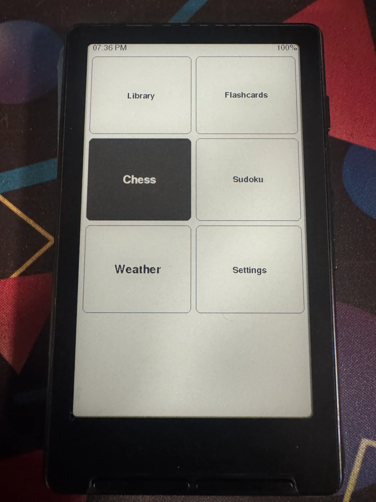
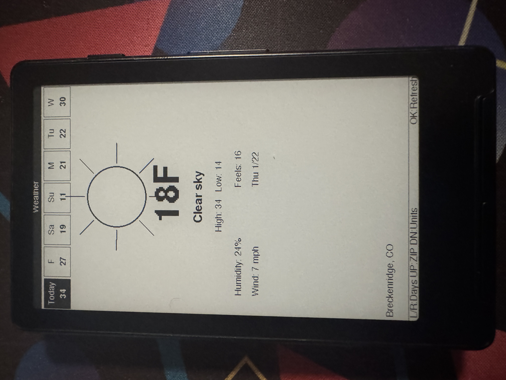
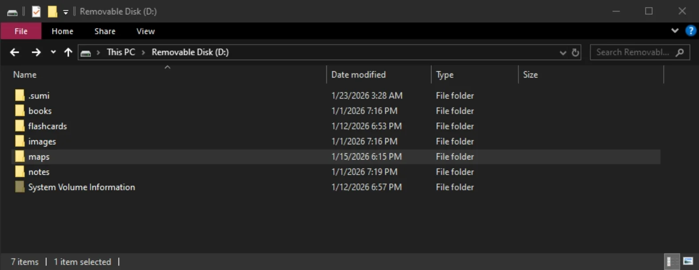
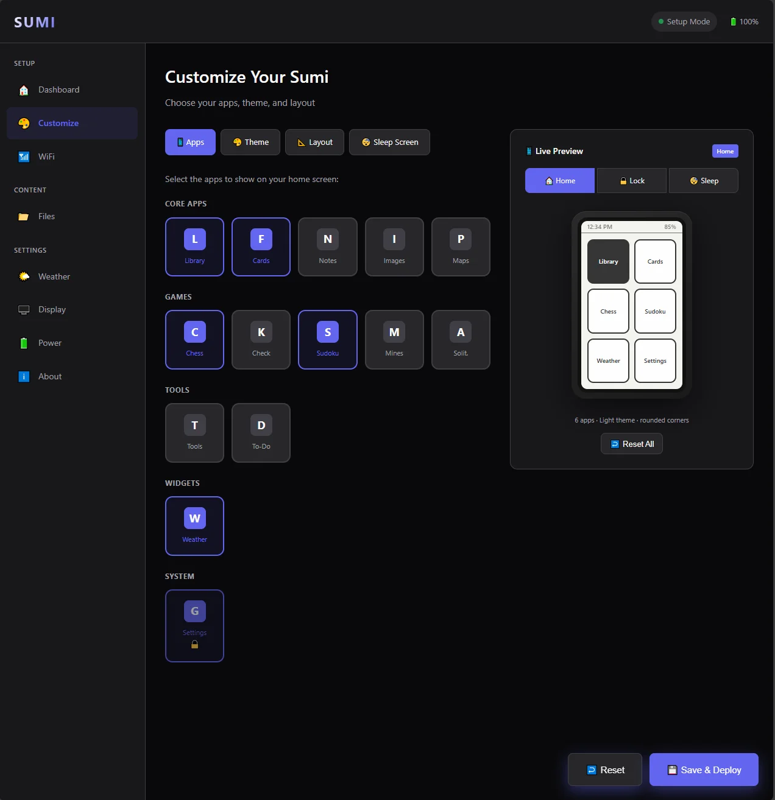
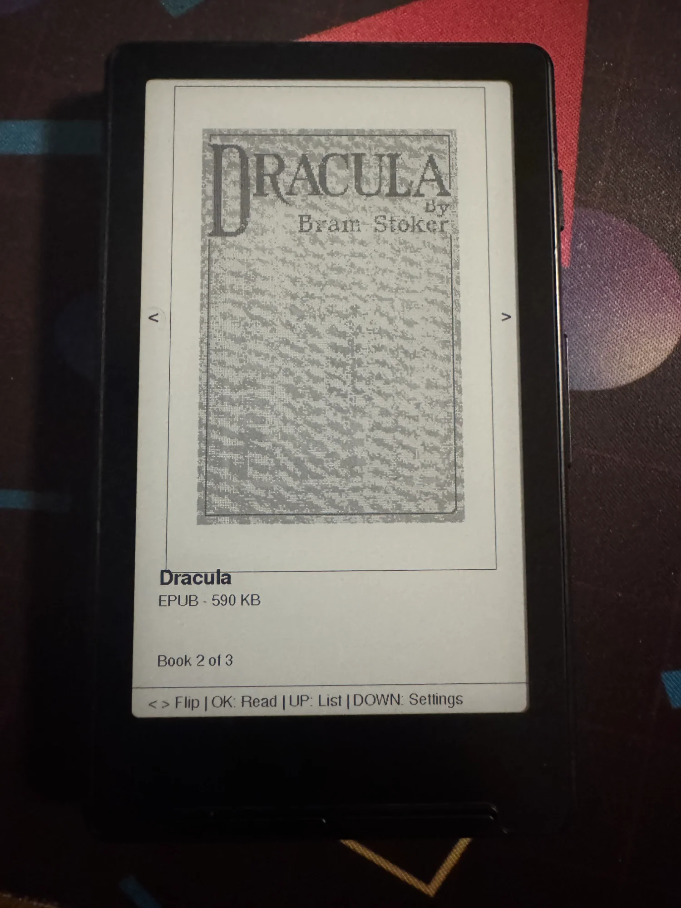
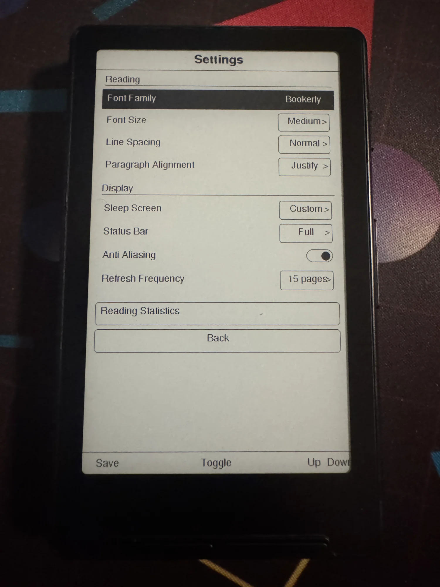
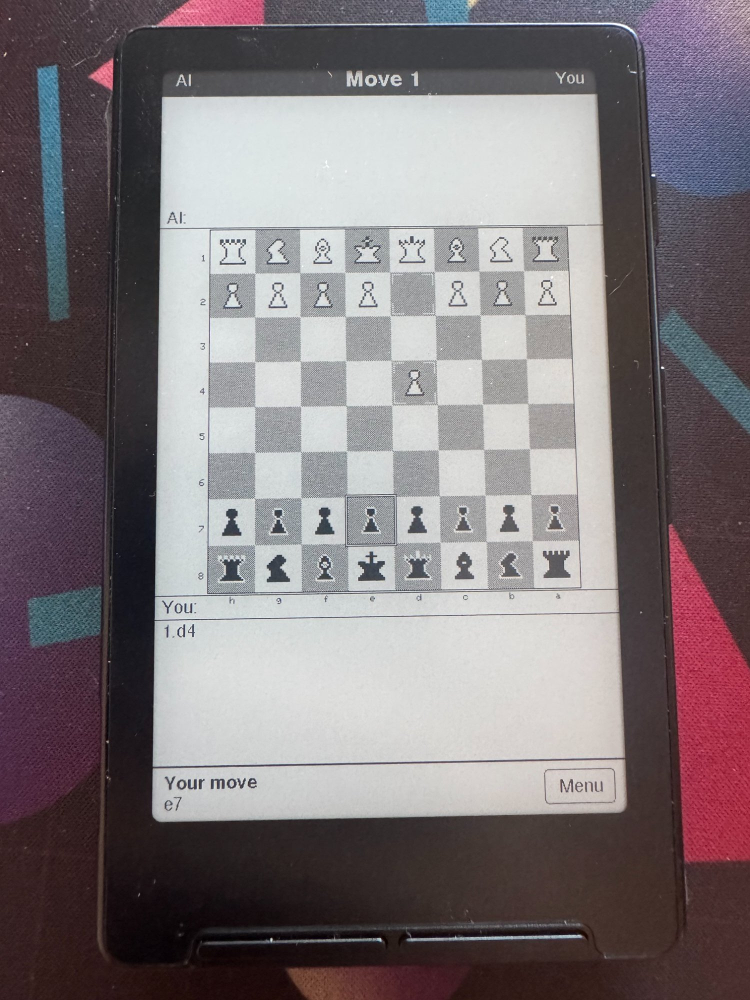
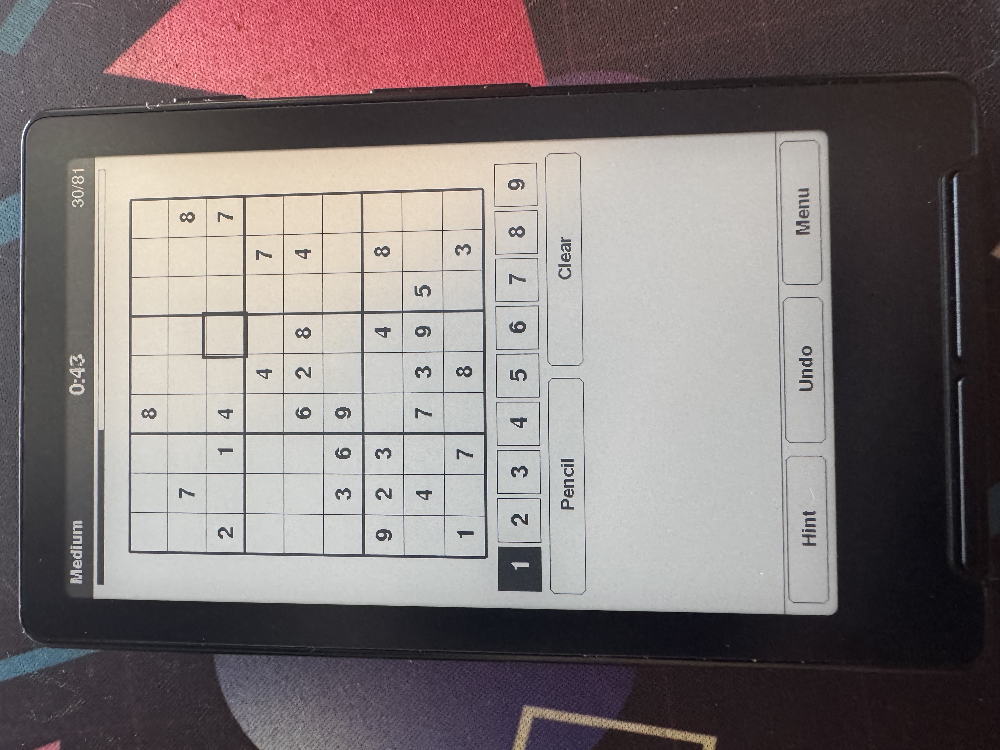
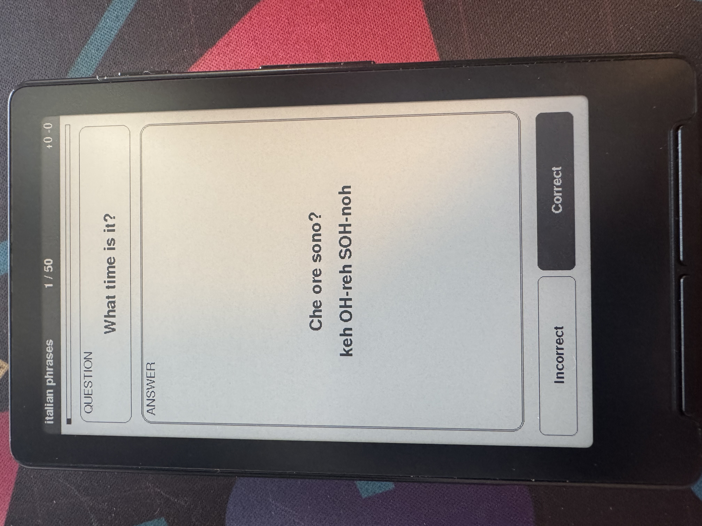
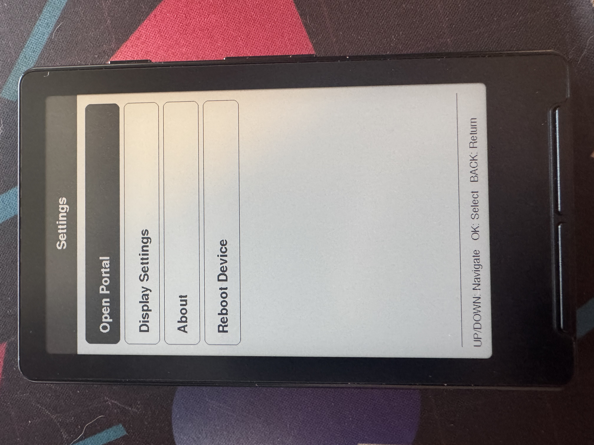

# SUMI

**Ink, Simplified.**

Custom firmware for the Xteink X4

---

<p align="center">
  
  
  
</p>

---

## ⚠️ Important: Read This First

**This project is a work in progress.** While the e-reader and most features work well, some things may still have bugs. If you run into issues:

- Check the [CHANGELOG](CHANGELOG.md) for recent fixes
- File an issue on GitHub
- Or just use the **factory firmware** that came on your device

SUMI is an active hobby project focused on making the Xteink X4 more useful. I'm sharing it because it might be helpful to others with similar devices.

**You have been warned.**


## ⚠️ SD Card Folder Structure (REQUIRED)

**The firmware will only recognize files in folders with these EXACT names.** If your folders are named anything else, SUMI won't find your files.

<p align="center">
  
</p>

Create these folders on your SD card **before using SUMI**:

```
SD Card Root/
├── books/          ← Put your .epub files here
├── flashcards/     ← Flashcard deck files go here
├── images/         ← BMP images only
├── maps/           ← Map tiles (if using maps)
└── notes/          ← Text notes
```

### Important Notes:
- **Folder names must be lowercase** and spelled exactly as shown
- **Don't rename these folders** - the firmware looks for these specific names
- You can create these folders manually, or the firmware will create them when you first use each app
- The firmware also creates hidden folders (`.cache`, `.config`, `.sumi`) automatically - don't delete these

### Quick Setup:
1. Insert your SD card into your computer
2. Create a folder called `books` (not "Books" or "BOOKS" or "My Books")
3. Create a folder called `images` (not "Pictures" or "Photos")
4. Create any other folders you need from the list above
5. Add your files to the appropriate folders
6. Insert SD card


---


## What Even Is This?

SUMI is custom firmware that turns your Xteink X4 into a little e-ink companion device with:

- A customizable home screen with widgets and apps you choose
- A web-based portal for configuration (no tiny screen menus!)
- **E-Reader with bookmarks, reading stats, and progress sync**
- Weather display with 7-day forecast
- Games (Chess, Sudoku, Minesweeper, Solitaire, and more)
- Spaced repetition Flashcards (FSRS algorithm)
- Bluetooth page turner support
- And other stuff

The whole idea is that you configure everything through a nice web interface on your phone/computer rather than navigating menus with 5 buttons on a slow e-ink screen.

---

## The Good, The Bad, and The Crashy

Let me be real about where things stand:

### ✅ Works Pretty Well

- **The Portal** - The web configuration interface is actually nice. You connect to the device's WiFi, open a browser, and configure everything from there. This part I'm happy with.
- **E-Reader / Library** - Read EPUBs and TXT files with bookmarks, reading statistics, and adjustable fonts/margins. Quick-open resumes your last book instantly.
- **Weather App** - Connects to OpenWeatherMap, shows 7-day forecast, auto-detects your location. Works reliably.
- **Home Screen** - Customizable grid of apps with widgets for current book and weather. Shows time and battery. Solid.
- **Games** - Chess, Sudoku, Minesweeper, Solitaire, Checkers. They're simple but functional.
- **Flashcards** - Create decks through the portal and study them with FSRS spaced repetition. Works fine.
- **Sleep/Wake** - Deep sleep works, wake-on-button works, battery life is good.
- **First-Time Setup** - The setup wizard walks you through connecting to WiFi and accessing the portal.
- **Backup/Restore** - Export and import all your settings from the portal.

### ⚠️ Works But Has Issues

- **Time Sync** - Works but syncs in background (non-blocking) after wake.
- **File Uploads** - Portal file upload works but can be slow for large files.
- **Notes App** - Basic functionality works but needs polish.
- **KOReader Sync** - Infrastructure is in place but needs more testing.
- **EPUB Images** - Beta support, simple images work but complex layouts may not.

### ❌ Needs Significant Work

- **PDF Support** - Listed in the portal but barely functional. Don't expect this to work.
- **Images App** - Supports BMP and JPEG. PNG support coming soon.
- **Maps** - Placeholder, not actually implemented.

---

## Hardware Requirements

- **MicroSD Card** - Required for storing books, images, settings. 8GB+ recommended.
- **USB-C cable** - For flashing firmware
- **A computer** - For flashing and using the portal

---

## Installation

### What You'll Need

1. [PlatformIO](https://platformio.org/) - Install the VS Code extension or CLI
2. [Python 3](https://python.org/) - For the portal build script
3. This repository

### Flashing Steps

1. **Clone the repo:**
   ```bash
   git clone https://github.com/psychoplath9450/SUMI.git
   cd SUMI
   ```

2. **Build the portal HTML** (packages the web interface into the firmware):
   ```bash
   cd portal
   python build.py
   cd ..
   ```

3. **Connect your Xteink X4 via USB-C**

4. **Build and upload:**
   ```bash
   pio run -t upload
   ```

5. **If things go wrong, erase and try again:**
   ```bash
   pio run -t erase
   pio run -t upload
   ```

### First Boot

On first boot (or after erasing), you'll see the setup wizard:

1. The device creates a WiFi hotspot called something like `Sumi-Setup-XXXX`
2. Connect to it with your phone or computer (no password)
3. Open `http://sumi.local` or `http://192.168.4.1` in your browser
4. You'll see the portal - connect to your home WiFi from there
5. Configure your apps, upload books, etc.

---

## Using SUMI

### Home Screen

<p align="center">
  
</p>

Navigate with the buttons:
- **UP/DOWN/LEFT/RIGHT** - Move selection
- **OK/SELECT** - Open selected app
- **BACK** - Return to home from any app

The home screen shows time (top left) and battery percentage (top right). Widgets show your current book cover and weather. The apps shown are whatever you've enabled in the portal.

### The Portal

The portal is where you do most configuration. To access it after initial setup:

1. Open **Settings** on the device
2. Select **Open Portal**
3. Connect to the `Sumi-Setup-XXXX` WiFi and visit `sumi.local`

<p align="center">
  
</p>

The portal lets you:
- Choose which apps appear on your home screen with live preview
- Upload books, flashcard decks, and images
- Configure weather location and display settings
- Adjust reader settings (font size, margins, line spacing)
- Backup and restore your settings

### E-Reader

<p align="center">
  
  
  
</p>

Full EPUB and TXT support with:
- Flippable cover browser for your library
- Justified text with adjustable fonts, margins, and line spacing
- Chapter navigation
- Bookmarks and reading statistics
- Progress tracking (chapter and page)
- Quick-resume to your last position

### Weather

<p align="center">
  
</p>

Shows current conditions and 7-day forecast. Uses OpenWeatherMap (free tier). Location is auto-detected from your IP, or you can set a ZIP code manually.

Controls:
- **LEFT/RIGHT** - Cycle through days
- **UP** - Change ZIP code
- **DOWN** - Toggle °F/°C
- **OK** - Refresh

### Games

<p align="center">
  
  
</p>

- **Chess** - Play against a simple AI with full rules (castling, en passant, promotion)
- **Sudoku** - Multiple difficulties with pencil marks
- **Minesweeper** - Classic minesweeper
- **Solitaire** - Klondike solitaire
- **Checkers** - Basic checkers

### Flashcards

<p align="center">
  
</p>

Spaced repetition flashcards using the FSRS algorithm. Create decks through the portal with question/answer pairs, then study on the device. Tracks your progress and schedules reviews.

### Settings

<p align="center">
  
</p>

Access WiFi settings, open the portal, adjust display settings, and reboot the device.

---

## Features

| Feature | Status | Notes |
|---------|--------|-------|
| Home Screen | ✅ Working | Customizable grid, widgets, time/battery display |
| Portal | ✅ Working | Web-based configuration with live preview |
| E-Reader | ✅ Working | EPUB/TXT, bookmarks, reading stats, adjustable fonts |
| Weather | ✅ Working | 7-day forecast, auto-location, widget display |
| Chess | ✅ Working | Play against simple AI |
| Sudoku | ✅ Working | Multiple difficulties |
| Flashcards | ✅ Working | Create via portal, FSRS spaced repetition |
| Checkers | ✅ Working | Basic implementation |
| Notes | ⚠️ Partial | Basic text notes |
| Images | ⚠️ Partial | BMP and JPEG formats |
| Maps | ❌ Not Done | Placeholder only |

---

## Known Issues

Things I know are broken that I haven't fixed yet:

1. **Complex EPUBs** - Very complex EPUBs with lots of CSS may still cause issues. Stick to simpler books.

2. **Portal shows wrong supported formats** - Says it accepts JPG/PNG for images but device only renders BMP and JPEG. PNG not supported yet.

3. **Time can be wrong after sleep** - If WiFi credentials aren't saved or network is unavailable, time won't sync.

4. **Partial refresh ghosting** - E-ink partial refresh leaves artifacts. Full refresh happens periodically to clear.

5. **Portal needs internet** - Uses CDN-hosted fonts/icons. Doesn't work fully offline.

---

## Project Structure

```
sumi/
├── src/
│   ├── core/           # Core system (power, wifi, settings, etc.)
│   ├── plugins/        # Apps (weather, chess, library, etc.)
│   └── main.cpp
├── include/
│   ├── core/
│   ├── plugins/
│   └── config.h        # Feature flags and pins
├── portal/
│   ├── js/app.js       # Portal JavaScript
│   ├── css/styles.css  # Portal styling  
│   ├── templates/      # HTML templates
│   └── build.py        # Builds portal into C header
├── lib/                # Dependencies (miniz, expat)
└── docs/               # Documentation and images
```

---

## Building from Source

```bash
# Install PlatformIO CLI or VS Code extension first

# Clone
git clone https://github.com/psychoplath9450/SUMI.git
cd SUMI

# Build portal (required before first build)
cd portal && python build.py && cd ..

# Build firmware
pio run

# Upload to device
pio run -t upload

# Monitor serial output (useful for debugging)
pio device monitor

# Full erase (if things are really broken)
pio run -t erase
```

---

## Contributing

Found a bug? Want to fix the EPUB renderer? PRs welcome.

The code is... not the cleanest. This started as a learning project and it shows. Don't judge too harshly.

Areas that need the most help:
- **EPUB rendering** - Memory management, complex CSS handling
- **Image format support** - Adding proper JPG/PNG decoding
- **General stability** - Memory leaks, crash recovery

---

## License

MIT. Do whatever you want with it.

---

## Acknowledgments

- [GxEPD2](https://github.com/ZinggJM/GxEPD2) for the display library
- [OpenWeatherMap](https://openweathermap.org/) for the free weather API
- Everyone who's worked on ESP32 Arduino libraries

---

## Final Thoughts

This project exists because I wanted to learn embedded development and I like e-ink. It's not trying to compete with Kindle or Kobo or any other firmwares. It's just a thing I made.


Happy hacking.
