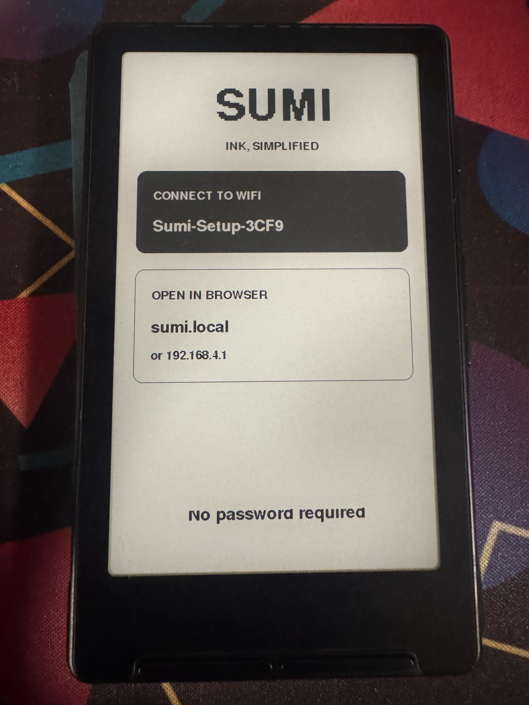
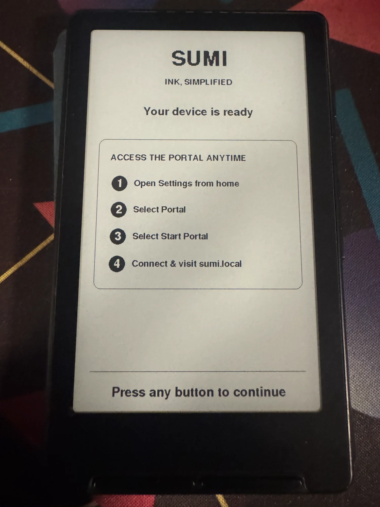
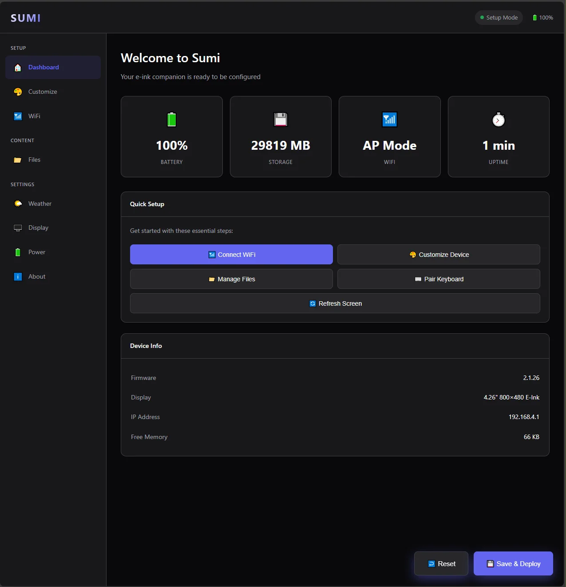
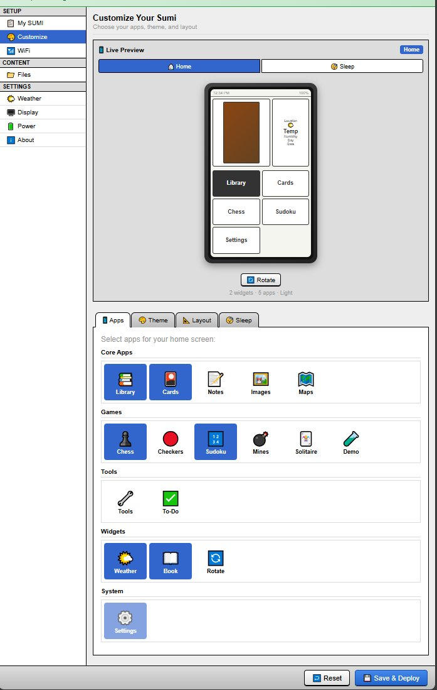

# SUMI

**Ink, Simplified.**

Custom firmware for the Inkplate 4.26" ESP32-C3 e-ink device.

---

## ⚠️ Important: Read This First

**This project is very much a work in progress.** If you're looking for a stable, daily-driver e-reader experience, this is not it. Seriously. Go use:

- **[Crosspoint](https://github.com/nicholasglazer/crosspoint)** - A more mature alternative firmware
- **Factory firmware** - What came on your device, it actually works reliably

SUMI is a hobby project I've been hacking on. Some things work great. Some things crash. The e-reader functionality in particular needs a lot of work. I'm sharing it because maybe someone finds it interesting or wants to contribute, not because it's ready for real use.

**You have been warned.**


## ⚠️ SD Card Folder Structure (REQUIRED)

**The firmware will only recognize files in folders with these EXACT names.** If your folders are named anything else, SUMI won't find your files.

Create these folders on your SD card **before using SUMI**:

```
SD Card Root/
├── books/          ← Put your .epub files here
├── flashcards/     ← Flashcard deck files go here
├── images/         ← BMP images only
└── notes/          ← Text notes
```

### Important Notes:
- **Folder names must be lowercase** and spelled exactly as shown
- **Don't rename these folders** - the firmware looks for these specific names
- You can create these folders manually, or the firmware will create them when you first use each app
- The firmware also creates hidden folders (`.cache`, `.config`, `.sumi`) automatically - don't delete these

### Quick Setup:
1. Insert your SD card into your computer
2. Create a folder called `books` (not "Books" or "BOOKS" or "My Books")
3. Create a folder called `images` (not "Pictures" or "Photos")
4. Create any other folders you need from the list above
5. Add your files to the appropriate folders
6. Insert SD card into your Inkplate


---


## What Even Is This?

SUMI is custom firmware that turns your Inkplate into a little e-ink companion device with:

- A customizable home screen with apps you choose
- A web-based portal for configuration (no tiny screen menus!)
- Weather display
- Games (Chess, Sudoku, etc.)
- Flashcards
- An e-reader (non functional currently)
- And other stuff

The whole idea is that you configure everything through a nice web interface on your phone/computer rather than navigating menus with 5 buttons on a slow e-ink screen.

---

## The Good, The Bad, and The Crashy

Let me be real about where things stand:

### ✅ Works Pretty Well

- **The Portal** - The web configuration interface is actually nice. You connect to the device's WiFi, open a browser, and configure everything from there. This part I'm happy with.
- **Weather App** - Connects to OpenWeatherMap, shows 7-day forecast, auto-detects your location. Works reliably.
- **Home Screen** - Customizable grid of apps, shows time and battery. Solid.
- **Games** - Chess and Sudoku work. They're simple but functional.
- **Flashcards** - You can create decks through the portal and study them. Works fine.
- **Sleep/Wake** - Deep sleep works, wake-on-button works, battery life is good.
- **First-Time Setup** - The setup wizard walks you through connecting to WiFi and accessing the portal.

### ⚠️ Works But Has Issues

- **Time Sync** - Works but can cause brief delays on wake (3-5 seconds) while it connects to sync.
- **File Uploads** - Portal file upload works but can be slow for large files.
- **Notes App** - Basic functionality works but needs polish.

### ❌ Needs Significant Work

- **E-Reader / Library** - This is the big one. The EPUB renderer has memory issues and will crash on complex books. Simple public domain stuff (Alice in Wonderland, etc.) usually works. Anything with lots of formatting, images, or complex CSS? Good luck. I've been chasing memory leaks and rendering bugs for a while. This is the main reason I say don't use this as a daily driver.
- **PDF Support** - Listed in the portal but barely functional. Don't expect this to work.
- **Images App** - Only supports BMP format currently. The portal will let you upload JPG/PNG but the device can't actually display them (I know, I know, I need to fix the portal to stop lying about this).
- **Maps** - Placeholder, not actually implemented.

---

## Hardware Requirements

- **MicroSD Card** - Required for storing books, images, settings. 8GB+ recommended.
- **USB-C cable** - For flashing firmware
- **A computer** - For flashing and using the portal

---

## Installation

### What You'll Need

1. [PlatformIO](https://platformio.org/) - Install the VS Code extension or CLI
2. [Python 3](https://python.org/) - For the portal build script
3. This repository

### Flashing Steps

1. **Clone the repo:**
   ```bash
   git clone https://github.com/psychoplath9450/SUMI.git
   cd SUMI
   ```

2. **Build the portal HTML** (packages the web interface into the firmware):
   ```bash
   cd portal
   python build.py
   cd ..
   ```

3. **Connect your Inkplate via USB-C**

4. **Build and upload:**
   ```bash
   pio run -t upload
   ```

5. **If things go wrong, erase and try again:**
   ```bash
   pio run -t erase
   pio run -t upload
   ```

### First Boot

On first boot (or after erasing), you'll see the setup wizard:

<p align="center">
  
</p>

1. The device creates a WiFi hotspot called something like `Sumi-Setup-XXXX`
2. Connect to it with your phone or computer (no password)
3. Open `http://sumi.local` or `http://192.168.4.1` in your browser
4. You'll see the portal - connect to your home WiFi from there
5. Configure your apps, upload books, etc.

Once you're done, you'll see this:

<p align="center">
  
</p>

Press any button and you're at the home screen.

---

## Using SUMI

### Home Screen

<p align="center">
  
</p>

Navigate with the buttons:
- **UP/DOWN/LEFT/RIGHT** - Move selection
- **OK/SELECT** - Open selected app
- **BACK** - Return to home from any app

The home screen shows time (top left) and battery percentage (top right). The apps shown are whatever you've enabled in the portal.

### The Portal

The portal is where you do most configuration. To access it after initial setup:

1. Open **Settings** on the device
2. Select **Portal**
3. Select **Start Portal**
4. Connect to the `Sumi-Setup-XXXX` WiFi and visit `sumi.local`

#### Dashboard

<p align="center">
  
</p>

Shows device status and quick actions.

#### Customize

<p align="center">
  
</p>

Choose which apps appear on your home screen. The live preview shows how it'll look. You can also change themes and layout here.

#### Files

<p align="center">
  
</p>

Upload books, images, flashcard decks, etc. Configure reader settings like font size and margins.

**Note about books:** Stick to simple EPUBs. Public domain books from Project Gutenberg usually work. Complex modern EPUBs with lots of styling tend to crash. I'm working on it.

### Weather

<p align="center">
  
</p>

Shows current conditions and 7-day forecast. Uses OpenWeatherMap (free tier). Location is auto-detected from your IP, or you can set a ZIP code manually.

Controls:
- **LEFT/RIGHT** - Cycle through days
- **UP** - Change ZIP code
- **DOWN** - Toggle °F/°C
- **OK** - Refresh

---

## Features

| Feature | Status | Notes |
|---------|--------|-------|
| Home Screen | ✅ Working | Customizable grid, time/battery display |
| Portal | ✅ Working | Web-based configuration |
| Weather | ✅ Working | 7-day forecast, auto-location |
| Chess | ✅ Working | Play against simple AI |
| Sudoku | ✅ Working | Multiple difficulties |
| Flashcards | ✅ Working | Create via portal, spaced repetition |
| Checkers | ✅ Working | Basic implementation |
| Notes | ⚠️ Partial | Basic text notes |
| Library/Reader | ❌ Unstable | Crashes on complex EPUBs |
| Images | ⚠️ Partial | BMP only, needs work |
| Maps | ❌ Not Done | Placeholder only |

---

## Known Issues

Things I know are broken that I haven't fixed yet:

1. **EPUB renderer crashes on complex books** - Memory issues with large files or complex CSS. This is the #1 problem.

2. **Portal shows wrong supported formats** - Says it accepts JPG/PNG for images but device only renders BMP. Misleading and annoying.

3. **Time can be wrong after sleep** - If WiFi credentials aren't saved or network is unavailable, time won't sync.

4. **Partial refresh ghosting** - E-ink partial refresh leaves artifacts. Need to do full refresh more often.

5. **No bookmark sync** - Reading position is saved but there's no cloud sync or anything.

6. **Portal needs internet** - Uses CDN-hosted fonts/icons. Doesn't work fully offline.

---

## Project Structure

```
sumi/
├── src/
│   ├── core/           # Core system (power, wifi, settings, etc.)
│   ├── plugins/        # Apps (weather, chess, library, etc.)
│   └── main.cpp
├── include/
│   ├── core/
│   ├── plugins/
│   └── config.h        # Feature flags and pins
├── portal/
│   ├── js/app.js       # Portal JavaScript
│   ├── css/styles.css  # Portal styling  
│   ├── templates/      # HTML templates
│   └── build.py        # Builds portal into C header
├── lib/                # Dependencies (miniz, expat)
└── docs/               # Documentation and images
```

---

## Building from Source

```bash
# Install PlatformIO CLI or VS Code extension first

# Clone
git clone https://github.com/psychoplath9450/SUMI.git
cd SUMI

# Build portal (required before first build)
cd portal && python build.py && cd ..

# Build firmware
pio run

# Upload to device
pio run -t upload

# Monitor serial output (useful for debugging)
pio device monitor

# Full erase (if things are really broken)
pio run -t erase
```

---

## Contributing

Found a bug? Want to fix the EPUB renderer? PRs welcome.

The code is... not the cleanest. This started as a learning project and it shows. Don't judge too harshly.

Areas that need the most help:
- **EPUB rendering** - Memory management, complex CSS handling
- **Image format support** - Adding proper JPG/PNG decoding
- **General stability** - Memory leaks, crash recovery

---

## License

MIT. Do whatever you want with it.

---

## Acknowledgments

- [Inkplate](https://inkplate.io/) for making cool e-ink hardware
- [GxEPD2](https://github.com/ZinggJM/GxEPD2) for the display library
- [OpenWeatherMap](https://openweathermap.org/) for the free weather API
- Everyone who's worked on ESP32 Arduino libraries

---

## Final Thoughts

This project exists because I wanted to learn embedded development and I like e-ink. It's not trying to compete with Kindle or Kobo or even other Inkplate firmwares. It's just a thing I made.

If you flash this and it works for you, cool! If it crashes and eats your SD card, sorry. You were warned.

Happy hacking.
